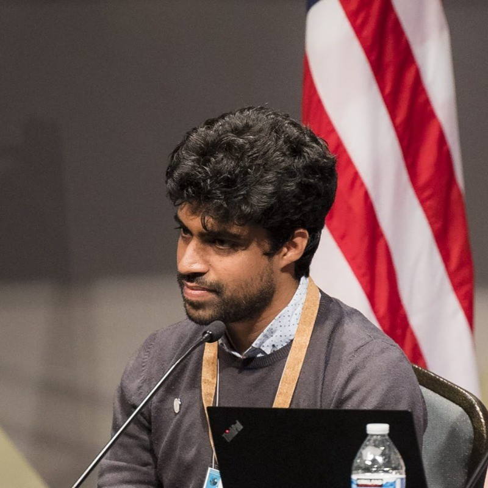

{: style="width: 150px; border-radius: 50%;"}

Hello! I’m **Othman Cherkaoui Dekkaki**, a Postdoctoral Researcher at the [College of Computing (COLCOM)](https://um6p.ma/fr/um6p-college-computing), UM6P in Ben Guerir, Morocco. I hold a Ph.D. in Applied Mathematics, with expertise in **bioeconomic modeling**, **optimal control theory**, and **viability theory**. My research focuses on developing innovative solutions to natural resource management challenges and advancing computational techniques for waste-to-energy processes.

### Education
- **Ph.D. in Applied Mathematics in 2024** 
  Faculty of Sciences, Mohammed V University, Rabat, Morocco  
  *Awarded with Honors (Très Honorable)*  
  Thesis: *Bioeconomic Modeling and Decision Support for Fishery Management and Waste-to-Energy Recovery*  
  Supervisors: Supervisors: [Prof. Nadia Raissi](mailto:n.raissi@um5r.ac.ma) and [Prof. Noha El Khattabi](mailto:n.elkhattabi@um5r.ac.ma)  

- **Master’s Degree in Applied Mathematics in 2017**  
  Faculty of Sciences, Mohammed V University, Rabat, Morocco  
  *UM5 Excellence Award – Top student in program*  
  Thesis: *Pricing in Fishery Management*

### Professional Experience
- I am leveraging my academic background to contribute to cutting-edge research at UM6P.
- I served as a Research/Teaching Assistant at Mohammed V University. I taught over 200 hours of mathematics courses including Analysis, Statistics, specialized mathematics for SVT programs, and optimal control theory and numerical methods for Master students.

### Notable Achievements
- Published in high-impact journals such as the *International Journal of Dynamics and Control* and *Mathematical Methods in the Applied Sciences*.
- Presented at prestigious conferences, including the 2023 American Control Conference.
- Served as a **All-Atlantic Ocean Youth Ambassador** for the All-Atlantic Ocean Research Alliance, contributing to initiatives like *Atlantic Data 2030*.
- Member of the **Blue-Cloud 2026 Expert Stakeholder Board**, providing high-level guidance and policy advice.
- **Early Career Ocean Professionals Morocco** (ECOP) National Coordinator.

### Interests
Beyond research, I am passionate about ocean data, environmental sustainability, and community-driven scientific initiatives. As a founding member of the **Early Career Ocean Professionals Morocco**, I actively organize conferences and workshops to inspire and connect young researchers.

Feel free to explore this site to learn more about my projects, publications, and collaborations. If you wish to connect, you can find me on [LinkedIn](https://www.linkedin.com/in/othman-cherkaouidekkaki/) or reach me via [email](mailto:cherkaouidekkakiothman@gmail.com).

---
*"Advancing science, one model at a time."*
